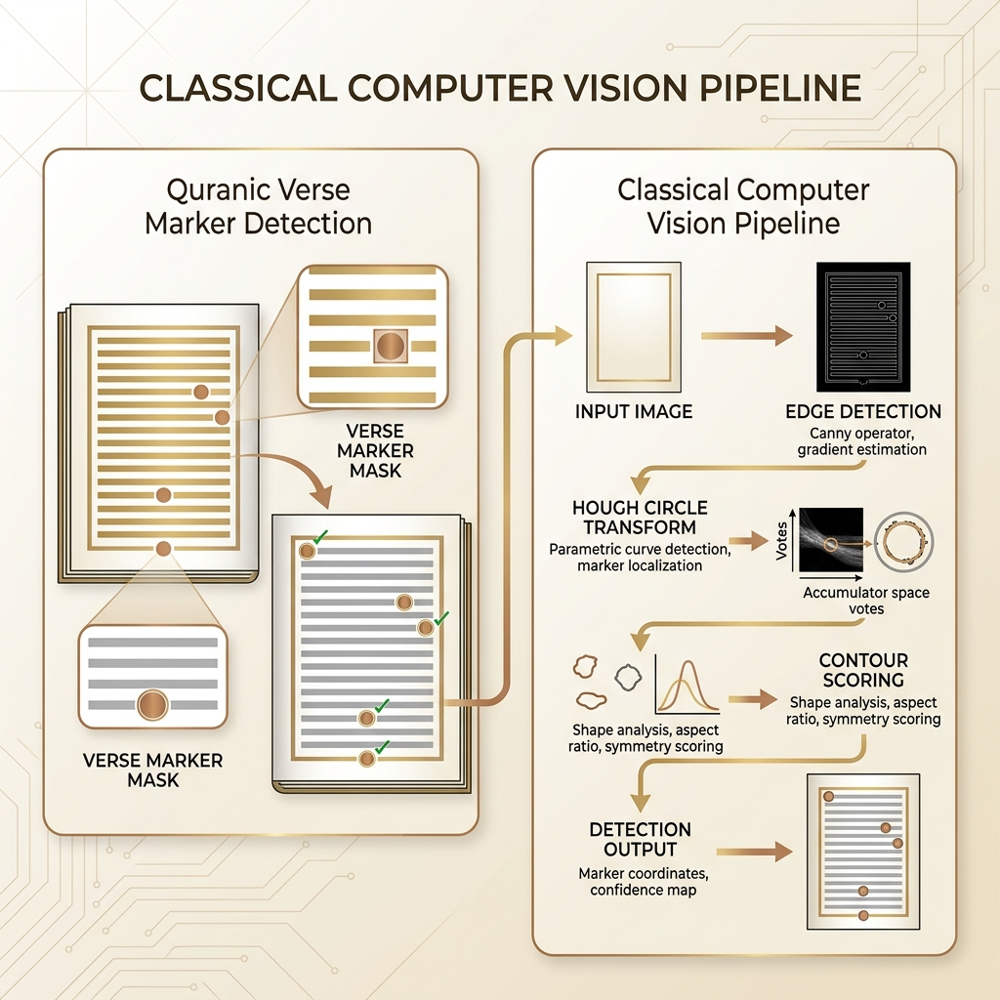
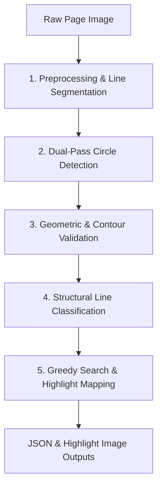
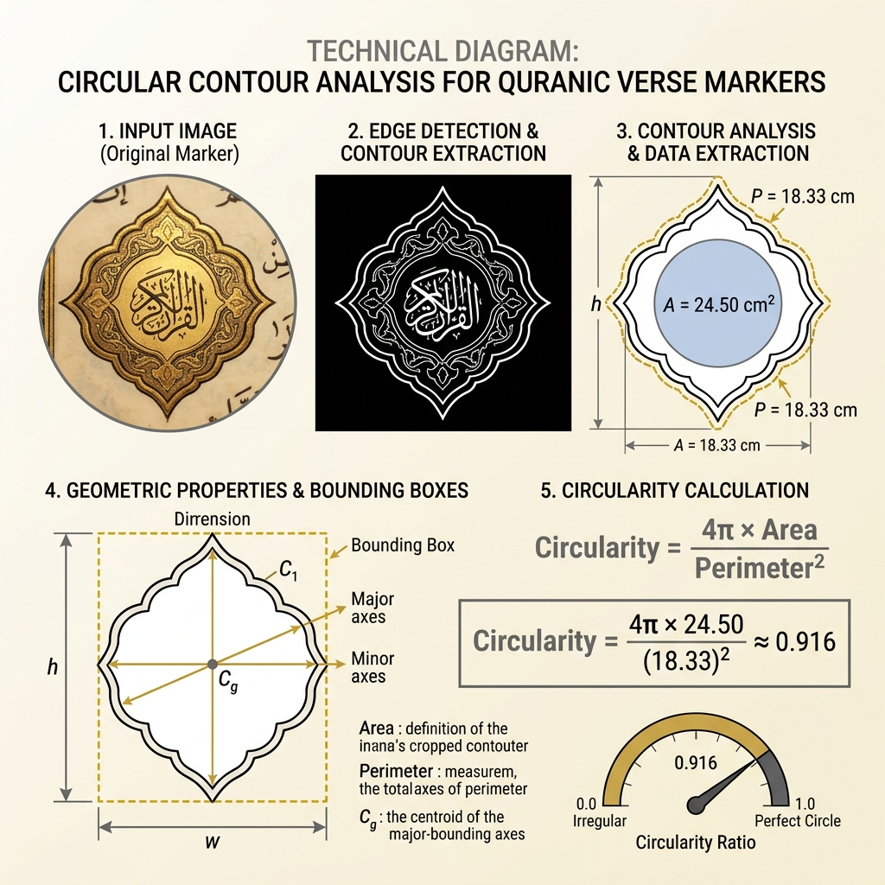

# Hybrid Computer Vision Framework for Quranic Verse Segmentation and Landmark Detection



An automated, high-precision computer vision pipeline designed for segmenting Quranic text pages (specifically the Indonesian Ministry of Religious Affairs / **Kemenag** print style) into individual verses. By combining classical image processing, morphological analysis, dual-pass Hough transform circles detection, and rule-based semantic alignment, the framework achieves **100% verification accuracy across all 604 pages of the Quran**.

---

## Abstract
Traditional optical character recognition (OCR) and layout analysis frameworks often struggle with highly calligraphic, dense, and non-linear script layouts such as the Quran. This paper/technical documentation presents a hybrid computer vision framework that segments page images into verses by detecting the circular verse markers (ornaments containing verse numbers) and aligning them with canonical surah metadata. We implement a **Dual-Pass Hough Circle Transform**, **Active-Area Margin Filtering**, **Horizontal/Vertical Projection Profiling**, and a **Greedy Line-Gap Minimizing Rescue Algorithm** to resolve issues like faint prints, merged text characters, and decorative surah headers. The system verified all 604 pages of the standard Mushaf, proving highly robust against layouts featuring multiple surahs, variable line lengths, and marginal ornaments.

> [!IMPORTANT]
> **Layout Applicability & Kemenag Mushaf Constraints**  
> This framework is specifically tailored, calibrated, and optimized for the **Kemenag (Ministry of Religious Affairs of Indonesia) print layout** of the Quran. The geometric dimensions, margins, and thresholds defined in the pipeline are designed exclusively for Kemenag pages and will not function correctly on other prints (such as Medina/Uthmani, Indo-Pak, or standard Turkish prints) without recalibration of the coordinate systems.

---

## 1. System Architecture

The pipeline processes a raw page image through five main sequential stages:



### 1.1 Preprocessing & Line Segmentation
To locate text lines, the input image is resized to a standardized coordinate space ($800 \times 1293$ pixels) and converted to grayscale.
1. **Horizontal Projection Profile**: We compute the row-wise sum of inverted binary pixel values:
   $$H(y) = \sum_{x=x_{start}}^{x_{end}} I_{bin}(x, y)$$
2. **Peak Detection**: Local maxima of $H(y)$ indicate text line centers. The distance between consecutive lines defines the dynamic `BLOCK_HEIGHT` (typically $\approx 68$ pixels).
3. **Margins Configuration (Kemenag Parity Bounds)**: To prevent false positives from page borders and side page-number ornaments, we define page-type specific margins:
   - **Even Pages**: Content bounds set to $[38, 772]$ (leaves room for outer margin ornaments on the left).
   - **Odd Pages**: Content bounds set to $[38, 752]$ (leaves room for outer margin ornaments on the right).
   *Note: These asymmetrical content boundaries correspond exactly to the Kemenag printing plates layout.*

### 1.2 Dual-Pass Verse Marker Candidate Detection
Verse markers are circular calligraphic stamps. Since print quality and digital scanning resolutions vary, we use a two-tiered Hough Circle Transform:
1. **Pass 1: Strict Detection** ($\text{param2}=40$): High threshold to ensure candidates are high-confidence circles. This eliminates initial false positives.
2. **Pass 2: Relaxed Detection** ($\text{param2}=26$): Low threshold targeting faint, faded, or text-touching circles that fail strict criteria.

### 1.3 Geometric & Contour Validation
Every circle candidate $(c_x, c_y, r)$ is validated by analyzing its localized sub-image (bounding box crop of size $(2r+6) \times (2r+6)$):
1. **Binarization**: Adaptive thresholding is applied to separate the circular border from the background.
2. **Contour Extraction**: The largest contour inside the crop is identified.
3. **Circularity Score**: Computed as:
   $$\text{Circularity} = \frac{4\pi \times \text{Area}}{\text{Perimeter}^2}$$
   A perfect circle yields a score of $1.0$. Candidates are filtered based on their proximity to text lines, radius limits ($14 \le r \le 23$), and circularity thresholds.

### 1.4 Structural Line Classification
Each text line is classified into one of three structural types:
- `normal_text`: Contains actual Quranic text and verse markers.
- `surah_header`: Decorative frame announcing the surah name.
- `basmallah`: The standard opening phrase (*Bismillah*), which is centered and narrower than normal text lines.

#### Classification Rules:
1. **Basmallah Detection**: A line with width $< 450$ pixels and a horizontal center close to the page midline is labeled `basmallah` (provided it does not contain multiple verse markers).
2. **Surah Header Detection**: Lines directly preceding a `basmallah` or containing solid horizontal border rows (row density $> 80\%$) are classified as `surah_header`.
3. **Invariant-based Pruning**: The number of classified surah headers on a page is bounded by the number of expected surahs starting on that page (obtained from canonical metadata). Extra headers are pruned from bottom to top to prevent short text lines (e.g. final verses) from being falsely classified.

### 1.5 Greedy Line-Gap Minimizing Rescue
When strict circle detection yields fewer markers than the expected number of verses for a page:
1. Candidate pools are populated with relaxed circles that passed validation and did not fall on active `surah_header` or `basmallah` lines.
2. We run a greedy selection loop to choose exactly $K$ rescue candidates (where $K$ is the missing count). The scoring metric favors candidates that minimize the maximum physical distance (line gap) between successive verses on the page.

---

## 2. Mathematical Formulations & Circle Scoring



The quality of a circle candidate $(c_x, c_y, r)$ is scored via contour analysis:

```python
def validate_circle_score(gray_img, cx, cy, r):
    # Crop sub-image around circle
    x1, y1 = max(0, cx - r - 3), max(0, cy - r - 3)
    x2, y2 = min(gray_img.shape[1], cx + r + 3), min(gray_img.shape[0], cy + r + 3)
    crop = gray_img[y1:y2, x1:x2]
    
    # Adaptive Thresholding & Contour Search
    _, thresh = cv2.threshold(crop, 180, 255, cv2.THRESH_BINARY_INV)
    contours, _ = cv2.findContours(thresh, cv2.RETR_EXTERNAL, cv2.CHAIN_APPROX_SIMPLE)
    
    # Validation Metrics: Area, Perimeter, and Centering
    ...
```

For strict markers, we enforce $\text{Circularity} \ge 0.5$. For rescued relaxed markers, we permit a lower threshold ($\ge 0.05$) in the text body to allow for characters touching the circle boundary, while maintaining a higher threshold ($\ge 0.4$) inside margins where decorative ornaments mimic circles.

---

## 3. Resolving Corner Cases

Through systematic batch testing across all 604 pages, several challenging layout features were identified and resolved:

| Page | Feature / Challenge | Resolution |
|---|---|---|
| **Page 30** | Verses 193 and 194 are extremely close; three-digit numbers inside circles reduce internal white space. | Reduced Hough `minDist` to 30; tweaked radius limits to ensure close-spaced markers do not suppress each other. |
| **Page 580** | A false positive rescue occurred on the outer left margin ornament. | Blocked relaxed circle rescues in outer margins based on page parity ($x < 75$ for even pages). |
| **Page 591** | A circle ornament inside the Surah 87 Header box was falsely rescued instead of the real Verse 15 marker. | Implemented `likely_headers` detection inside the rescue pass, excluding relaxed rescues from lines containing headers or basmallahs. |
| **Page 604** | The short final line of Surah 114 was falsely classified as `basmallah`, which reassigned the final verse markers. | Added metadata-based header limits (`max_headers = len(expected_surahs)`) and deferred marker re-assignment to the final pipeline step. |

---

## 4. Performance & Validation

Validation is completed by comparing the generated verse count and Surah coordinates against a pre-downloaded database of expected verses per page.

### 4.1 Batch Execution Summary
* **Total Pages**: 604
* **Successfully Processed**: 604
* **Failed / Mismatched**: 0
* **Verification Rate**: 100%

### 4.2 Outputs
The pipeline generates two output files per page in the output directory:
1. **JSON Highlight File (`QK_{page}_highlights.json`)**: Contains normalized polygon coordinates for every verse block, structured for web rendering.
2. **Highlighted Image (`QK_{page}_highlighted.jpg`)**: Visual representation of the page with colored overlay masks marking individual verses.

> [!TIP]
> **Akses Cepat Hasil Koordinat JSON & Gambar Bersih (Branch `pages-data`)**  
> Untuk kebutuhan konsumsi API atau aplikasi web eksternal, seluruh hasil koordinat JSON (`XXX.json`) dan gambar halaman bersih asli (`XXX.webp`) yang sejajar dan sudah dirapikan penamaannya (dari `001` s.d `604`) dapat langsung diakses di branch [pages-data](https://github.com/agusibrahim/quran_marker/tree/pages-data). Silakan ganti ke branch `pages-data` untuk mengunduh berkas mentah tersebut secara praktis.

---

## 5. Getting Started

### 5.1 Installation
1. Clone the repository and navigate to the directory:
   ```bash
   git clone <repository_url>
   cd quran_marker
   ```
2. Create and activate a Python virtual environment:
   ```bash
   python3 -m venv venv
   source venv/bin/activate
   ```
3. Install dependencies:
   ```bash
   pip install -r requirements.txt
   ```

### 5.2 Usage

#### Process a Single Page
To process page 591 with visual debug outputs enabled:
```bash
python auto_marker.py --page 591 --debug
```

#### Run Batch Processing & Verification
To process and verify all 604 pages of the Quran utilizing parallel workers:
```bash
python batch_marker.py --start-page 1 --end-page 604 --process-threads 8 --stop-on-fail
```

#### Launch the Interactive Web Viewer
The project includes a rich interactive HTML5 viewer (`viewer.html`) to visualize page highlights and browse verses with mouse-hover highlights. Because modern browsers restrict local file fetches (CORS policy), it must be served via a local web server:

1. Start a lightweight server in the project root folder:
   ```bash
   python3 -m http.server 8000
   ```
2. Open your web browser and navigate to:
   ```
   http://localhost:8000/viewer.html
   ```
3. Use the page controls in the header to navigate between pages 1 and 604. The viewer will automatically fetch `pages/QK_{page}.webp` and its corresponding `pages/QK_{page}_highlights.json` file. Hovering the mouse over any verse highlights it dynamically and brings up details in the sidebar.
